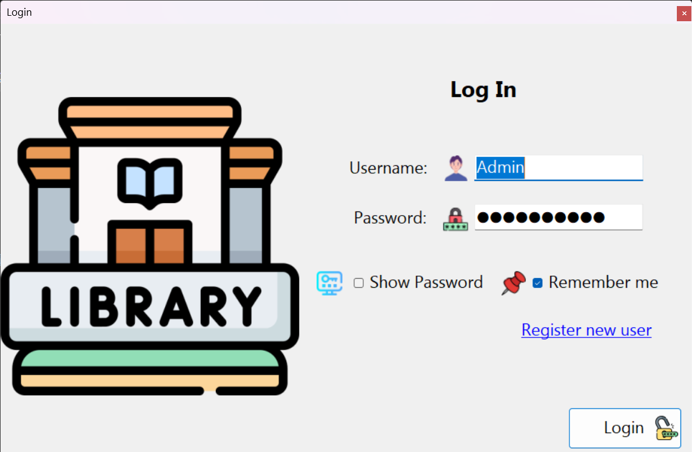
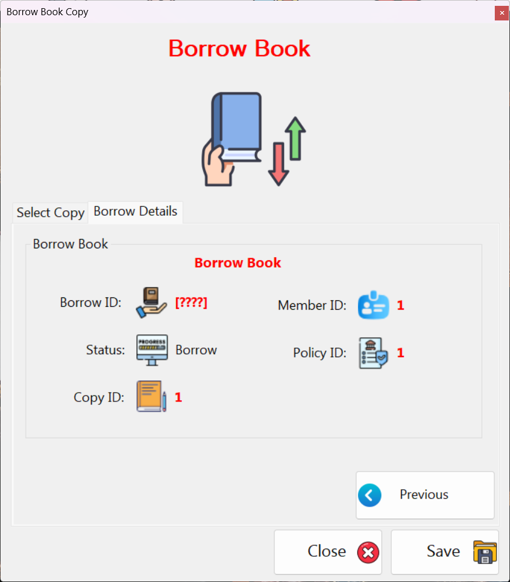
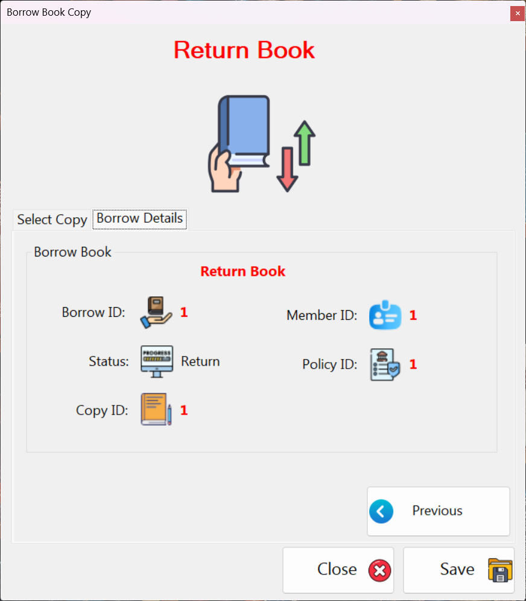
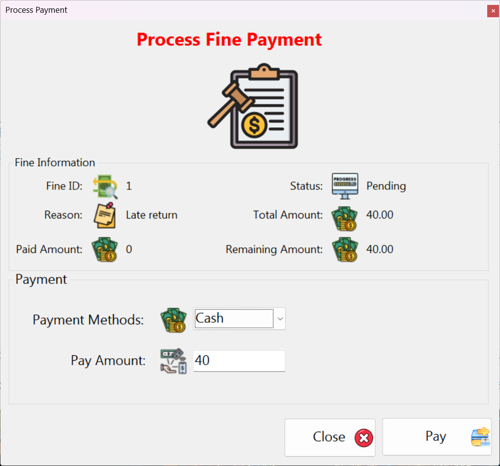
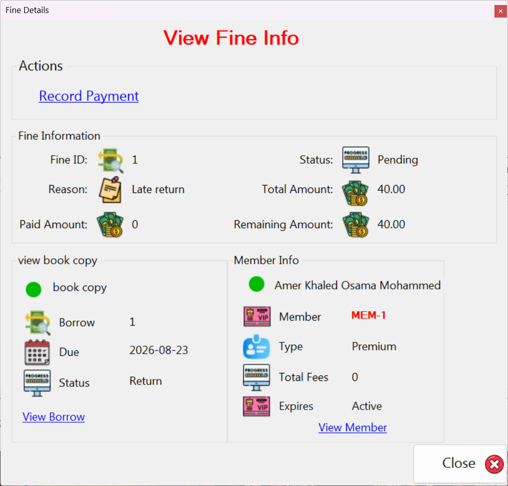

# Library Management System

A full-stack desktop application for managing books, categories, borrowing, returns, and fines. Built from scratch as my first large, solo project.

---

## Features

- **Book Management** – Add books, organize into categories, and track multiple physical copies per book.
- **Copy Tracking** – Each copy has its own condition (As New, Fine, Damaged) and status (Available, Borrowed, Lost).
- **Borrowing & Returns** – Members borrow copies, return them, and the system automatically calculates late fees.
- **Fine Handling** – Damaged or lost books generate fines automatically based on condition and replacement costs.
- **User Authentication** – Secure PBKDF2-SHA256 password hashing with per-user salts and account lockout.
- **Role-Based Permissions** – Different access levels (Manage Users, Manage Books, Manage Fine Payments, etc.).

---

## Tech Stack

- **Language:** C# (.NET Framework 4.7.2 / .NET 6+ compatible)
- **UI:** Windows Forms (WinForms)
- **Database:** SQL Server (ADO.NET)
- **Testing:** xUnit (Unit Tests)
- **Security:** PBKDF2-SHA256 with 600,000 iterations

---

## Architecture

The code is split into three logical layers:

- **Data Access Layer (DAL)** – Handles all database operations (CRUD + stored procedures) using parameterized queries to prevent SQL injection.
- **Business Logic Layer (BLL)** – Encapsulates business rules (fine calculations, membership expiration, borrow limits).
- **Presentation Layer (UI)** – WinForms bound to the BLL via DTOs.

Key insight: **Books and Book Copies are separate entities.** A book is a catalog entry (ISBN, Author, Category). A copy is a physical item (Condition, Status, Price). This separation was critical for accurate inventory and fine tracking.

---

## Database

I used a mix of **inline SQL** for simple CRUD and **stored procedures** for complex transactions (borrowing, returning, damaged/lost books). The stored procedures handle all the ACID logic – checking availability, creating transactions, updating statuses, and calculating fines in one atomic operation.

---

## What I Did Right

- Parameterized queries everywhere (no SQL injection).
- `using` statements on all database connections (no resource leaks).
- Async data loading for UI responsiveness.
- Error logging instead of swallowing exceptions.

---

## What I'd Do Differently

- Use Git from day one (instead of `LibrarySystem_v2_final_REAL_final` 🤦).
- Sketch the database schema properly before writing code (I changed it four times).
- Consider Entity Framework for future iterations.
- Build a web API instead of WinForms – but I don't regret starting with what I knew, because I **finished** it.

---

## Setup Instructions

1. **Clone the repository.**
2. **Create a SQL Server database** (e.g., `LibraryDB`).
3. **Run the table creation scripts** (`/Database/Schema.sql`).
4. **Run the stored procedure scripts** (`/Database/StoredProcedures.sql`).
5. **Run the seed data script** (`/Database/SeedData.sql`).
6. **Update the connection string** in `App.config` to point to your SQL Server instance.
7. **Build and run** the solution in Visual Studio.

> If you get stuck, open an issue or message me – happy to help.

---

## Screenshots
### Login Screen

### Main Dashboard

### Borrow Transaction

### Return Transaction

### Fine Payment

### Fine Details

## What I Learned

- How to design a relational database with real-world constraints.
- How to handle `DBNull.Value` in C# gracefully (that one took me way too long).
- When to use stored procedures vs. inline SQL.
- That the "simple" features always have the most edge cases.
- Most importantly: **I can actually finish a project this big, even when I want to quit every other day.**

---

## Author
**Abdulrhman Daleh** – C# Developer  

---

## Connect with Me

- **LinkedIn:** (https://www.linkedin.com/in/abdulrhman-x-daleh/)
- **GitHub:** (https://github.com/Abdulrhman-Daleh)
- **Email:** (abdulrhman.daleh.dev@gmail.com) 
